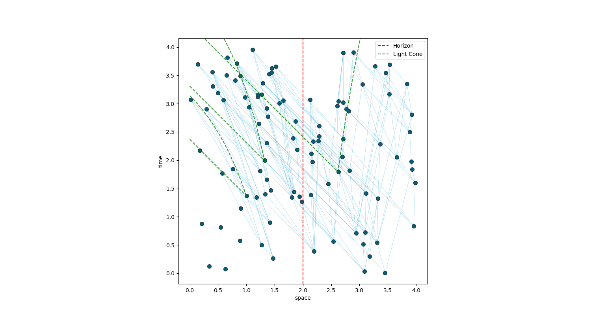

# FRAMEWORK FOR CAUSET CODING

## Introduction

Causal set theory is an approach to quantum gravity where a spacetime continuous manifold is replaced by a discrete locally finite, partially ordered sets i.e., causal sets or, in short, causets. This repository contains C++ modules for numerical investigations of causal set theory, and a python module for plotting.

The possible representations of the causets here implemented are:

- causal matrices C, such C_ij = 1 iff i preceeds j.
- past/future sets S, such that S[i] contains j iff i follows/preceeds j.
- past/future link sets LS, such that LS[i] contains j iff 'j prec i / i prec j' is a link.  

Causets can be embedded in a region of spacetime. The code currently supports:

- shapes: cube, cuboid, cylinder, ball, bicone(diamond).
- spacetimes: Minkowski/Flat, Schwarzschild/BlackHole. The latter can use the following coordinates: Schwarzschild, EF-v, EF-t*.

## The modules

The C++ modules(classes) in scripts_cpp/causets_cpp:

- causet.cpp(Causet): handles a generic causet, NOT embedded in a spacetime, i.e. the points do not have coordinates assigned.
- embeddedcauset.cpp(EmbeddedCauset): it inherits from Causet to handle a causet embedded in a region of spacetime.
- sprinkledcauset.cpp(SprinkledCauset): it inherits from EmbeddedCauset to generate via Poisson Sprinkling a causet embedded in a given region of spacetime.
- shapes.cpp(Shape): it handles the definition of the aforementioned implemented shapes
- spacetime.cpp(Spacetime): it handles the definition and properties of a the spacetime metrics.

The python modules in scripts_py/causets_py:

- causetplotting.py: functions for the plotting of a causet from a file saved in the format determined by the EmbeddedCauset::save_causet() and EmbeddedCauset::save_molecules() functiona. As this coding framework was born for horizon molecules' analysis, it is also possible to plot certain type of horizon molecules. It uses 'matplotlib'.
- causethelpers.py: some functions in support of the plotting.

The modules (classes and functions) are documented.

## Requirements

The C++ boost library is required for integration and equation solving. We used boost_1_80_0, which should be available at this link here [https://www.boost.org/users/history/version_1_80_0.html](https://www.boost.org/users/history/version_1_80_0.html) The boost/numeric/odeint/integrate/integrate.hpp file was modified, adding the following at line 59:

```c++
//I PUT THIS
template<class System , class State , class Time , class Observer >
size_t 
integrate( System system , State &start_state , Time start_time , Time end_time , Time dt , Observer observer )
{
    typedef controlled_runge_kutta< runge_kutta_dopri5< State , State , State , Time > > stepper_type;
    return integrate_adaptive( stepper_type() , system , start_state , start_time , end_time , dt , observer );
}
```

Also, if you lack the mutex C++ module, which is possible on Windows, it is advisable to comment out lines 409-412 in boost/math/special_functions/detail/polygamma.hpp.

Finally, plotting in Python makes use of scipy, numpy and matploltib.pyplot. 

## Testing

Most of the implemented code has been tested. The test files are in scripts_cpp/tests and scripts_py. Their name contains the string 'test'. It is specified whether functions have been tested.

## Example Results

The following is a plot of a 100-events Causet embedded in a cubic region of a 2D Schwarzschild spacetime, in EF-t^* coordinates. Light cones on the manifold of three points are also explicitly shown.


Then, the main results of our work: the distribution of n-lambda molecules across the horizon of a 3+1D Schwarzschild black hole. We studied up to 750k-elements causet and we saw the number of lambdas scales proportional with area, and the distribution of the n-lambdas follows an exponential fall (like thermodynamic molecules).


## Use and License

If you wish to contribute to the project, please get in contact via email:
<stefano.veroni19@imperial.ac.uk>,
<vid.homsak19@imperial.ac.uk>

If you use the code for your project, please cite:
"Homsak V, Veroni S. Framework for Causet Coding. 2022."

The source code is published under the BSD 3-Clause License, see [license file](LICENSE.md).
Copyright (c) 2020-2022, Stefano Veroni, Vid Homsak

## Further Information

The structure of the code was partially inspired by Christoph Minz's code in Python. His modules, and other files, are currently inside the trash folder, which contains material that was once useful, but not anymore.
