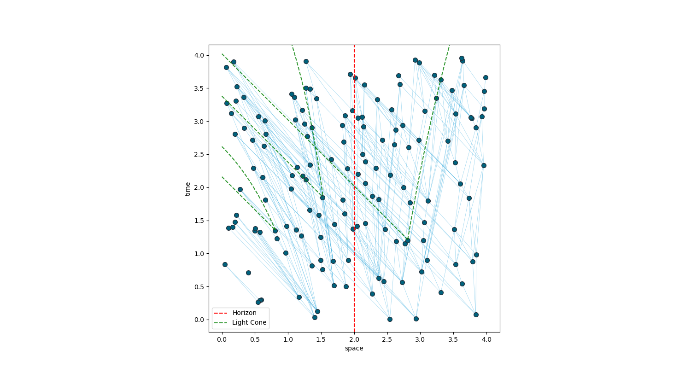

# FRAMEWORK FOR CAUSET CODING

## Introduction

Causal set theory is an approach to quantum gravity where a spacetime continuous manifold is replaced by a discrete locally finite, partially ordered sets i.e., causal sets or, in short, causets. This repository contains C++ modules for numerical investigations of causal set theory, and a python module for plotting.

The possible representations of the causets here implemented are:

- causal matrices C, such C_ij = 1 iff i preceeds j.
- past/future sets S, such that S[i] contains j iff i follows/preceeds j.
- past/future link sets LS, such that LS[i] contains j iff 'j prec i / i prec j' is a link.  

Causets can be embedded in a region of spacetime. The code currently supports:

- shapes: cube, cuboid, cylinder, ball, bicone(diamond).
- spacetimes: Minkowski/Flat, Schwarzschild/BlackHole. The latter can use the following coordinates: Schwarzschild, EF-v, EF-t*.

## The modules

The C++ modules(classes) in scripts_cpp/causets_cpp:

- causet.cpp(Causet): handles a generic causet, NOT embedded in a spacetime, i.e. the points do not have coordinates assigned.
- embeddedcauset.cpp(EmbeddedCauset): it inherits from Causet to handle a causet embedded in a region of spacetime.
- sprinkledcauset.cpp(SprinkledCauset): it inherits from EmbeddedCauset to generate via Poisson Sprinkling a causet embedded in a given region of spacetime.
- shapes.cpp(Shape): it handles the definition of the implemented.
- spacetime.cpp(Spacetime): it handles the definition and properties of a certain spacetime metric.

The python module is scripts_py/CausetPlotting.py. This allows for the plotting of a causet from a file saved in the format determined by the scripts_cpp/causet.cpp/Causet::save_causet() function. As this coding framework was born for horizon molecules' analysis, it is also possible to plot certain type of horizon molecules. The module uses 'matplotlib'

The modules (classes and functions) are documented.

## Testing

Most of the implemented code has been tested. The test files are in scripts_cpp/tests and scripts_py. Their name contains the string 'test'.

## Examples

The following is a plot of a 150-events Causet embedded in a cubic region of a 2D Schwarzschild spacetime, in EF-t^* coordinates. Light cones on the manifold of three points are also explicitly shown.

## Use and License

If you wish to contribute to the project, please get in contact via email:
stefano(dot)veroni19[at]imperial(dot)ac(dot)uk
vid(dot)homsak19[at]imperial(dot)ac(dot)uk

The source code is published under the BSD 3-Clause License, see [license file](LICENSE.md).
Copyright (c) 2020-2022, Stefano Veroni, Vid Homsak

## Further Information

The structure of the code was partially inspired by Christoph Minz's code in Python. His modules, and other files, are currently inside the trash folder, which contains material that was once useful, but not anymore.
